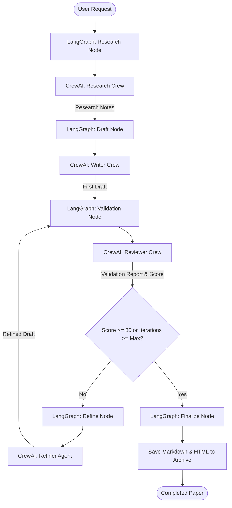

# Implementation Plan - Multi-Agent Research Paper Generator & Validator

Build a python-based multi-agent system utilizing **CrewAI** (for role-playing agents/tasks) and **LangGraph** (for stateful workflow orchestration and validation loops), exposed via a **FastAPI** backend, and a premium **Vanilla CSS/JS** frontend dashboard.

---

## User Review Required

> [!IMPORTANT]
> **LLM Provider Options**: By default, the application will support:
> 1. **Groq** (using Llama-3-70b/8b or Mixtral-8x7b) — Recommended for speed and quality. Requires a free Groq API key.
> 2. **OpenRouter** (using Llama-3, Qwen-2.5, or Mistral) — Highly flexible. Requires an OpenRouter API key.
> 3. **Ollama** (local execution) — Free and private, but requires the user to run Ollama locally with models loaded (e.g., `llama3` or `mistral`).
>
> **Internet Search Tool**: DuckDuckGo Search will be used out-of-the-box (no API key required). Tavily Search can be optionally enabled if the user provides a Tavily API key.

---

## Architecture Overview

We will build a hybrid architecture combining the best of CrewAI and LangGraph:
- **LangGraph** manages the state machine and the outer loops (e.g., the validation loop, conditional routing, history persistence).
- **CrewAI** manages groups of collaborative agents inside specific LangGraph nodes (e.g., a "Research Crew" with search and analysis agents, and a "Writer Crew" with draft and formatting agents).
- **FastAPI** serves the REST API and streams progress updates using **Server-Sent Events (SSE)**.
- **Frontend** is a single-page app (SPA) styled with vanilla CSS (glassmorphism, dark mode, glowing accents) that lets users input topics, view live logs, inspect validation scores, and browse/read the archive of generated papers.

---

## Proposed Changes

### Backend Setup
We will set up a virtual environment and configure a standard Python package layout.

#### [NEW] [requirements.txt](file:///t:/ArchiveGuru/requirements.txt)
Dependencies for the project:
- `fastapi`, `uvicorn`, `sse-starlette` (Backend API & streaming)
- `crewai`, `crewai-tools` (Agent execution & prebuilt tools)
- `langgraph` (Workflow state machine)
- `langchain`, `langchain-openai`, `langchain-community` (LLM wrappers & generic utilities)
- `duckduckgo-search`, `arxiv` (Search APIs)
- `python-dotenv` (Configuration)

#### [NEW] [config.py](file:///t:/ArchiveGuru/config.py)
Config management (reads `.env`, configures paths, validates keys).

#### [NEW] [agents.py](file:///t:/ArchiveGuru/agents.py)
Defines CrewAI agents and tasks:
- **Researcher Agent**: Crawls web & ArXiv for sources.
- **Writer Agent**: Compiles the draft paper/article in Markdown.
- **Reviewer (Validator) Agent**: Performs rigorous academic peer-review, checking claims, logic, and structure, and returns a JSON grade (0-100) and review comments.
- **Refiner Agent**: Rewrites specific sections based on Reviewer's feedback.

#### [NEW] [workflow.py](file:///t:/ArchiveGuru/workflow.py)
Defines the LangGraph State, Nodes, and Router:
- `ResearchState` dictionary.
- Nodes for `research`, `draft`, `validate`, `refine`, and `finalize`.
- SSE logging callback to stream real-time execution steps to the client.

#### [NEW] [main.py](file:///t:/ArchiveGuru/main.py)
FastAPI server containing:
- `/api/generate` (POST endpoint that starts the LangGraph workflow)
- `/api/stream/{job_id}` (GET SSE endpoint for real-time progress)
- `/api/papers` (GET/GET-by-id endpoints to query generated papers from the archive)
- Static files mounting for the frontend.

---

### Frontend Setup
A premium single-page web dashboard using CSS glassmorphism, responsive columns, and real-time logs.

#### [NEW] [index.html](file:///t:/ArchiveGuru/static/index.html)
Beautiful structural HTML with:
- Config panel (Topic, Word Count, LLM Provider, API Keys).
- Live execution tracker (Visual status card per node, glowing spinner, real-time agent console log).
- Validation summary (Final score gauge, peer-review comments).
- Interactive reader (Rendered Markdown previewer, table of contents, download button).
- Saved Archives drawer.

#### [NEW] [style.css](file:///t:/ArchiveGuru/static/style.css)
Premium Vanilla CSS styling:
- Outfit/Inter Google Font.
- CSS variables for clean dark theme with indigo/cyan gradients.
- Custom scrollbars, glassmorphic panels (`backdrop-filter: blur()`), glowing status borders, and pulse animations.

#### [NEW] [app.js](file:///t:/ArchiveGuru/static/app.js)
Frontend logic:
- Initiates paper generation.
- Listens to Server-Sent Events (SSE) to update the status timeline and console logs in real time.
- Renders the Markdown content into standard HTML on the fly.
- Handles history loading, detail viewing, and downloads.

---

## Verification Plan

### Automated/Local Testing
1. **Dependency Verification**: Build the virtual environment, install requirements, and run a validation script `verify_env.py` to ensure CrewAI, LangGraph, and LLM integrations can import correctly under Python 3.13.
2. **Workflow Unit Tests**: Run a short, dummy mock run (using a small prompt/limit) to verify that the LangGraph transition logic runs without errors and outputs a structured Markdown file.

### Manual Verification
1. **Interactive Demo**: Open the local server at `http://localhost:8000`.
2. **Generate a Paper**: Submit a topic like "Quantum Computing in 2026: Quantum Supremacy and Practical Algorithms".
3. **Verify the Live Feed**: Monitor the logs as they flow from Research Node -> Draft Node -> Validation Node -> Finish.
4. **Inspect the Result**: Verify that the generated article contains clear headings, references, logical flow, and a validation score.
5. **View Archive**: Refresh and load previously generated papers to verify history preservation.
